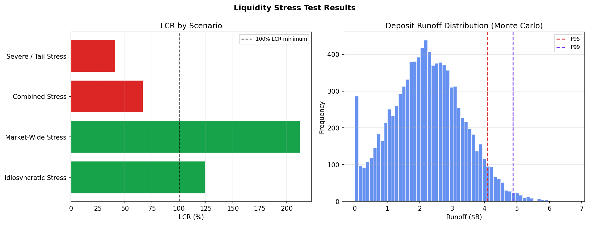

# liquidity-stress-toolkit

A liquidity stress testing framework for banks and financial institutions. Runs scenario analysis across four stress regimes, calculates LCR and survival horizon, and runs Monte Carlo simulations on deposit runoff uncertainty.

Built on publicly available Basel III / LCR concepts. Useful for risk analysts, treasury teams, and students studying bank liquidity management.

> **Disclaimer:** For educational and research purposes only. Does not guarantee regulatory compliance. See [DISCLAIMER.md](DISCLAIMER.md).

---

## What it does

**Scenario stress test** — run four stress scenarios against your balance sheet and see which ones pass the 30-day LCR minimum:

```
Scenario                    HQLA+Secured   Outflows   Net Liq    LCR%   Survival  Pass?
----------------------------------------------------------------------------------------
Idiosyncratic Stress       $      13.0B $   10.4B $   2.5B   124.4%     37.3d      ✓
Market-Wide Stress         $      11.7B $    5.5B $   6.2B   212.3%     63.7d      ✓
Combined Stress            $      10.7B $  15.9B $  -5.3B    66.8%     20.0d  ✗ FAIL
Severe / Tail Stress       $       9.0B $  21.9B $ -12.9B    41.2%     12.3d  ✗ FAIL
```

**Monte Carlo deposit simulation** — model runoff uncertainty across 10,000 paths:

```
Mean runoff:      $2.24B
95th percentile:  $4.08B
99th percentile:  $4.88B
Prob runoff >10%: 30.3%
```



---

## Quickstart

```bash
git clone https://github.com/shishaustin/liquidity-stress-toolkit.git
cd liquidity-stress-toolkit
python -m venv .venv && source .venv/bin/activate
pip install numpy scipy matplotlib
python demo.py
```

---

## Usage

```python
from liquidity import run_all_scenarios, monte_carlo_deposit_stress

# Your balance sheet inputs ($B)
results = run_all_scenarios(
    hqla_bn=8.5,
    retail_deposits_bn=28.0,
    wholesale_funding_bn=12.0,
    secured_borrowing_capacity_bn=6.0,
    committed_credit_lines_bn=5.5,
)
print(results[["scenario", "lcr_pct", "survival_horizon_days", "passes_30day_lcr"]])

# Monte Carlo deposit uncertainty
mc = monte_carlo_deposit_stress(
    base_deposits_bn=28.0,
    mean_runoff_pct=0.08,
    std_runoff_pct=0.04,
    n_simulations=10_000,
)
```

---

## Scenario definitions

| Scenario | Retail runoff | Wholesale runoff | Contingent draws | Description |
|----------|--------------|-----------------|-----------------|-------------|
| Idiosyncratic | 10% | 50% | 30% | Firm-specific event (ratings downgrade) |
| Market-Wide | 5% | 25% | 20% | Systemic dislocation |
| Combined | 15% | 75% | 50% | Both simultaneously |
| Severe | 25% | 90% | 75% | Extreme tail — SVB-style dynamics |

Scenarios are fully configurable in `liquidity/scenarios.py`.

---

## Regulatory context

Framework draws on publicly available guidance:
- **Basel III LCR** (BIS, 2013) — Liquidity Coverage Ratio standard
- **Basel III NSFR** (BIS, 2014) — Net Stable Funding Ratio standard

This is an educational implementation, not a certified regulatory tool.

---

## Stack

Python 3.9+ · numpy · scipy · matplotlib

---

## License

MIT — see [LICENSE](LICENSE). See [DISCLAIMER.md](DISCLAIMER.md) for full terms.
